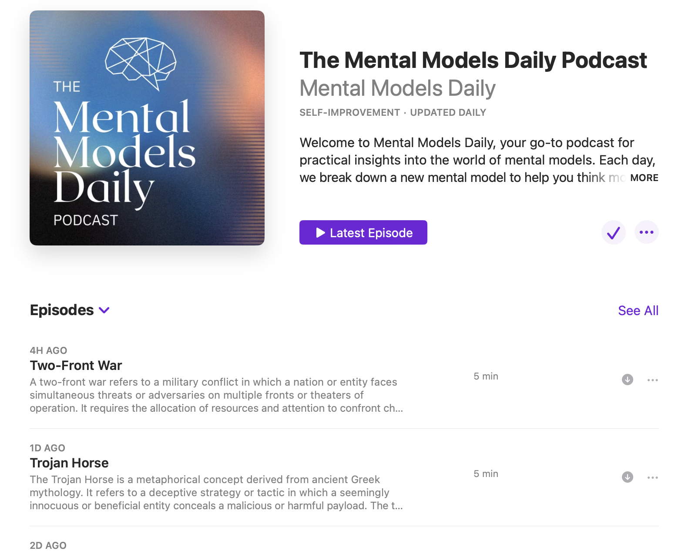
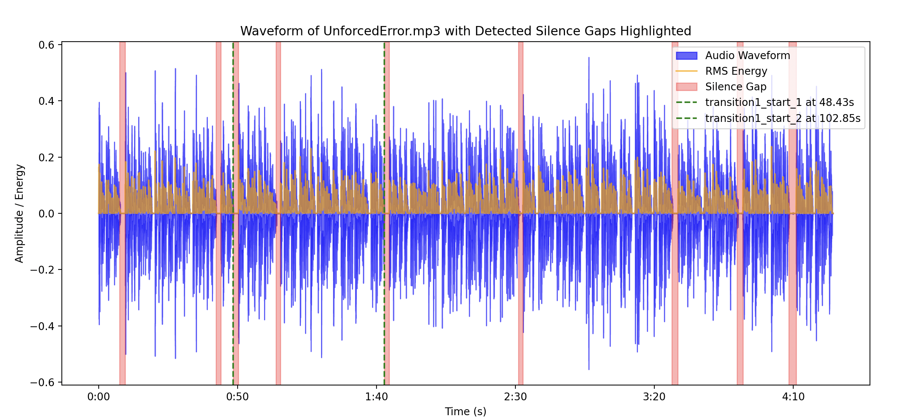

# Podcast Generator using LLMs and Text2Speech, incl. automated audio post-processing. 

The Podcast Generator project automates the creation of podcast episodes on Mental Models. It generates transcripts, converts them to audio files, identifies transition points, and overlays custom audio for seamless transitions.

This project currently uses the Anthropic Claude 3.5 model API for transcript generation; ElevenLabs API for text to speech generation. The code is used to automate podcast creation of The Mental Models Daily Podcast. 

Example outputs of this code can be found here:

Youtube: https://www.youtube.com/@MentalModelsDaily/podcasts 

Spotify: https://open.spotify.com/show/1f0qi12saeBEJmtnjOSszg 

Amazon Music: https://music.amazon.co.uk/podcasts/6da552cf-1714-45ce-b302-7c6c69386fc3/mental-models-daily

Apple Podcasts: https://podcasts.apple.com/gb/podcast/mental-models-daily/id1754257683

Castbox: https://castbox.fm/channel/Mental-Models-Daily-id6203840?country=us

iHeartRadio: https://www.iheart.com/podcast/269-mental-models-daily-189536773/



## Project Structure

```
podcastGenerator/
├── src/
│   └── podcastGenerator/
│       ├── config.py
│       ├── main_module.py               # Main entry point
│       └── utils/
│           ├── transcript_generator.py
│           ├── read_text.py
│           ├── audio_generator.py
│           ├── plot_audio.py
│           └── overlay_audio.py
└── README.md
```

## Features

1. **Transcript Generation**: Generates transcripts for a given list of mental models and saves them as `.docx` files. Transcript generation called the Anthropic Claude 3.5 Sonnet model. This is configurable to a model of your choice.  
2. **Text-to-Audio Conversion**: Converts transcripts to audio files in `.mp3` format. This function called the ElevenLabs API. The voice can be changed to a speaker of your choice in the config file. 
3. **Audio Transition Identification**: Detects transition points in audio files for smooth flow.
4. **Audio Overlay**: Adds custom transition music and overlays it on generated audio files at specified timestamps.

## Requirements

To install the required packages, you’ll need to set up a Conda environment. Follow these steps:

### Setting Up the Environment

1. **Create and Activate the Conda Environment**
   ```bash
   conda create -n podcast_env python=3.8
   conda activate podcast_env
   ```

2. **Install Packages from `requirements.txt`**
   ```bash
   while read requirement; do conda install --yes $requirement || pip install $requirement; done < requirements.txt
   ```

This will install all required packages for the project.

## Usage

The main entry point is located in `src/main_module.py`. To generate podcast episodes:

1. **Specify Mental Models**: In the `main()` function of `main_module.py`, update the `mental_models` list with the names of mental models you wish to create transcripts and audio files for.

2. **Run the Script**:
   ```bash
   python src/main_module.py
   ```

3. **Output**: The program will generate transcripts and audio files for each mental model, and overlay transition music at identified points.

## Configuration

Modify paths and audio settings in `config.py` to set output directories for transcripts and audio files and customize overlay audio files (intro, transitions, outro) and timestamps as needed.

## Contributing

1. Fork the repository.
2. Create a feature branch: `git checkout -b feature/feature-name`.
3. Commit changes: `git commit -am 'Add new feature'`.
4. Push to the branch: `git push origin feature/feature-name`.
5. Create a new Pull Request.

## License

This project is licensed under the MIT License. See `LICENSE` for more details.



